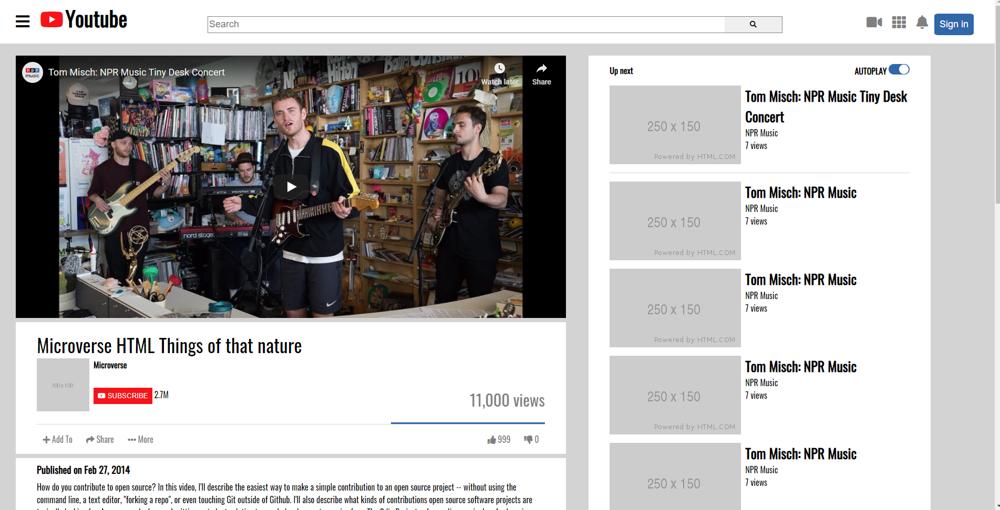

# Project Name

> A clone of the Youtube Video Player made completely in HTML and CSS. Extensive use of Flexbox with CSS as it makes things easier with page alignment.

The page has a navbar, a section for the video that includes it's description, channel name, video views, and likes and dislikes. There is also a sidebar that shows the upcoming videos as well as any reccomended videos.  The page concludes with a footer that would lead to various information about YouTube.

## Built With

- HTML5
- CSS3

## Getting Started

To get a local copy up and running follow these simple example steps.

### Prerequisites
- Windows, MAC, or Linux operating systems
- Internet Browser such as Google Chrome or Firefox

### Setup
- Clone the repository or download the zip available from github 

### Usage
- Locate the index.html file and double click it to view the page

## Authors

👤 **Author1**

- GitHub: [@Janluc](https://github.com/janluc)
- Twitter: [@Janluc123](https://twitter.com/Janluc123)
- LinkedIn: [LinkedIn](https://www.linkedin.com/in/janluc-saneaux-91707a1b4/)

👤 **Author2**

- GitHub: [@sumon0002001](https://github.com/sumon0002001)
- Twitter: [@Sumon0002009](https://twitter.com/Sumon0002009)
- LinkedIn: [LinkedIn](https://www.linkedin.com/in/seteve-john-294a1318a/)

## 🤝 Contributing

Contributions, issues, and feature requests are welcome!

Feel free to check the [issues page](issues/).

## Show your support

Give a ⭐️ if you like this project!

## Acknowledgments

- Hat tip to anyone whose code was used
- Inspiration
- etc

## 📝 License

This project is [MIT](lic.url) licensed.
